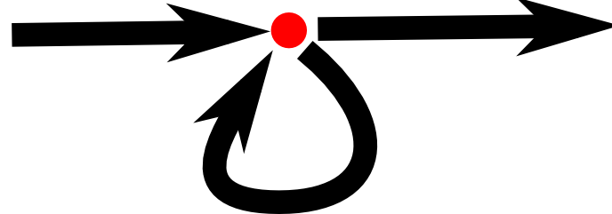

---
## Chapter 2: Program Structure
HÀ
---

THẮNG
---

THÔNG
---

SƠN
###WHILE AND DO LOOPS
*Xem một chương trình in tất cả các số chẵn từ 0- 12. Một cách để viết chương trình là như sau.*
```javascript
	console.log(0);
	console.log(2);
	console.log(4);
	console.log(6);
	console.log(8);
	console.log(10);
	console.log(12);
```
Những dòng code ở trên hoạt động bình thường nhưng chúng t cần một chương trình đơn giản hơn cũng với những chức năng là in ra các số chẵn từ 0-12.
Nếu như chúng tôi cần in ra các số chẵn từ 0-1000 thì sao ? Chắc chắn là khi áp dụng những dòng code ở trên vào đây thì nó sẽ không kả thi.
Những gì chúng ta cần ở đây là có thể lặp lại được những dòng code .Đây là một hình thức kiểm soát luồng `control flow` được gọi là vòng lặp `loop`.

Vòng lặp cho phép chúng ta quay lại một vài điểm trong chương trình trước và lặp lại nó nới chương trình hiện tại của chúng ta. Nếu chúng ta kết hợp một biến đếm , chúng ta có thể làm như sau:
```javascript
var number = 0;
while(number <=12){
  console.log(number);
  number=number +2;
}
//-> 0
//->2
//....
```

TÂN
---

---
### Summary

Bây giờ bạn biết rằng chương trình xây dựng dựa trên các khối lệnh, có thể ngay cả chính bản thân nó chứa nhiều khối lệnh bên trong khác. Khi 1 lệnh đặt sau 1 lệnh khác, chương trình sẽ chạy từ trên xuống. Bạn có thể làm gián đoạn chương trình bằng các sử dụng các khối lệnh điều kiện (`if`, `else` hoặc `switch`) và vòng lặp (`while`, `do` hoặc `for`).

Các biến có thể được dùng để lưu trữ những mảnh dữ liệu bằng một định danh (name) và chúng sẽ hữu ích để theo dõi trạng thái trong chương trình của bạn.

Hàm (Function) là một giá trị đặc biệt có chức năng đóng gói thành các mảnh nhỏ của một chương trình. Bạn có thể gọi hàm bằng các viết `functionName(argument1, argument2), hàm có thể chạy một khối lệnh hoặc đơn giản là trả ra một giá trị.
